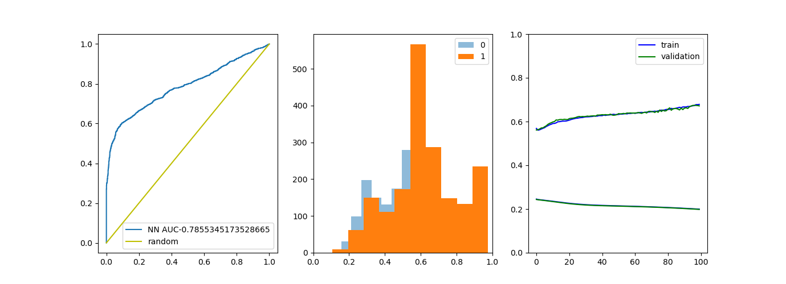

# AIFriendly-complex-dynamics
AI-Friendly detects phase-space points that are forbidden at t=inf
<br>
<i>The theoretical background is as follows: given a nonlinear homogeneous ODE in two dimensions, the existence of repulsors can be confirmed by looking for stationary points which have an infinitesimal evolution operator with an outward-pointing gradient. i.e. the linealized equation on the fixed points has only strictly-positive eigenvalues. <br> To generate the database you (1) generate such equations, (2) calculate the eigenvalues of the linearized equations around the fixed points (it takes aproximately 1 second per equation) and (3) append the equation to the database with the correct tag. </i>


```bash
bash generate_database.sh
```


